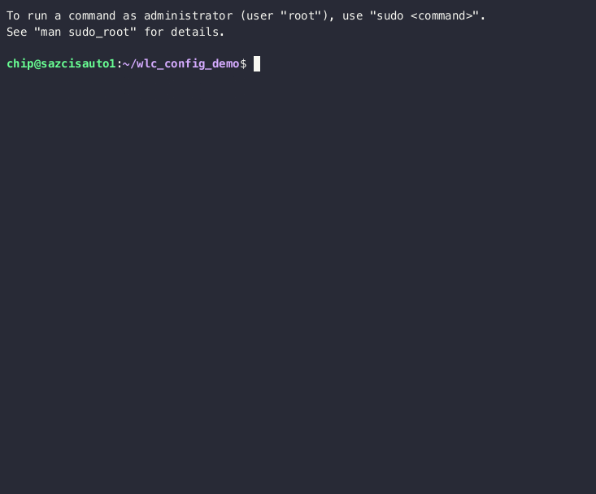

# Ansible Config Push

Now that we've built our inventory and proved we can connect to the device with our credentials lets actually do some
automation tasks.  In this demo we'll take the templates shown previously, fill them with some data, and push the config
to our device.

## Ansible Vars

Ansible uses variables (or vars for short) for all kinds of uses including task and playbook selection along with 
filling in data for templates.  These vars can some from many places.  A var can be defined in multiple places and this
provides a rich ability to override depending on where it is placed.  Perhaps you want to set a default value but for
certain types of device override that default with something more appropriate.  For a full description of the process
have a look at [Ansible Variable Precedence](https://docs.ansible.com/ansible/latest/playbook_guide/playbooks_variables.html#ansible-variable-precedence). 

## Our Template Vars

When using ansible playbooks to deploy configuration, our automation goal is re-usability.  We've written a playbook
and a role to push our intended configuration to the device.  However, we have not yet defined any vars to fill out
our template.  Since each time we deploy a wireless lan we will likely have unique values.  

We could have a set of vars files that defines every single one of our wireless lan configs.  The workflow would then
be to edit this config file, add the new wireless lan, commit the files to git, and then have a git pipeline to do 
the actual deployment.  However, that is beyond the scope of this demo.

For our purposes, each user will have a specific wireless lan to deploy.

Let's create a file for our wireless lan and put in all the vars needed.

Create and edit `data.yml` file and fill in the following (filling in the information provided for your pod):

```yaml
---
wlan_name: SJCRH-Pod1
wlan_id: 100
wlan_ssid: SJCRH-Pod1
wlan_password: THE_POD1_PASSWORD
```



Now when we run ansible we can reference this file of vars and it will be used in our playbook and template to push
the config to the device.  Let's do that now.

## Config Push Playbook

First lets take a look at our playbook.

```shell
(venv) chip@sazcisauto1:~/wlc_config_demo$ cat playbooks/configure.yml
---
- name: Configure WLC
  hosts: wlc
  become: true
  roles:
    - wlc_config
```

This playbook doesn't really have any 'tasks'.  It only calls a role: 'wlc_config'.  Since we don't really need to do
anything other than push the config at the moment.  

Let's take a look at the role.


